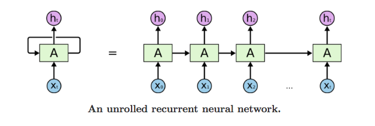
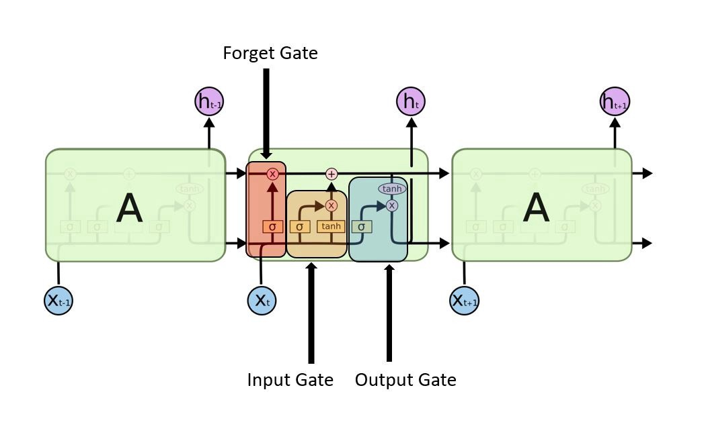

### What is Neural Network?
뉴럴 네트워크(신경망)은 인간의 두뇌와 매우 유사하고 패턴을 인식하도록 설계된 알고리즘 세트입니다. 뉴럴 네트워크는 기계 인식을 통해서나 정제되지 않은 원시 데이터를 라벨링 또는 클러스터링 하는 것을 통해 감각 데이터를 해석합니다. 또한, 변환되어야 하는 현실 세계의 이미지, 사운드, 텍스트, 시계열 등의 데이터에 들어있는 벡터를 포함한 숫자 패턴을 인식할 수 있습니다.(They can recognize numerical patterns, contained in vectors, into which all real-world data ( images, sound, text or time series), must be translated.) 인공 신경망은 문제를 해결하기 위해 함께 작동하는 고도로 상호 연결된 수많은 처리 요소(뉴런)로 구성됩니다

(ANN은 일반적으로 병렬로 작동하고 계층으로 배열된 많은 수의 프로세서를 포함합니다. 첫 번째 계층은 원시 입력 정보를 수신합니다. 이는 인간의 시각 처리에서 시신경과 유사합니다. 각 연속 계층은 원시 입력이 아닌 이전 계층에서 출력을 수신합니다. 같은 방식으로 시신경에서 더 멀리 있는 뉴런은 더 가까운 계층에서 신호를 수신합니다. 마지막 계층은 시스템의 출력을 생성합니다..)

### What is Recurrent Neural Network(RNN)?
순환 신경망은 내부 메모리가 있는 피드포워드 신경망을 일반화한 것입니다. RNN은 모든 데이터 입력에 대해 동일한 기능을 수행하는 반면 현재 입력의 출력은 과거 계산에 따라 달라지기 때문에 본질적으로 순환적입니다. 출력을 생성한 후에는 복사되어 순환 네트워크로 다시 전송됩니다. 

결정을 내리기 위해 현재 입력과 이전 입력에서 학습한 출력을 고려합니다. 피드포워드 신경망과 달리 RNN은 메모리를 사용하여 입력 시퀀스를 처리할 수 있습니다. 따라서 분할되지 않은 연결된 필기 인식 또는 음성 인식과 같은 작업에 적용할 수 있습니다. 다른 신경망에서는 모든 입력이 서로 독립적입니다. 그러나 RNN에서 모든 입력은 서로 관련되어 있습니다.

- 순환 신경망의 장점
    - RNN은 각 샘플이 이전 샘플에 의존한다고 가정할 수 있도록 데이터 시퀀스를 모델링할 수 있습니다.
    - 순환 신경망은 효과적인 픽셀 이웃을 확장하기 위해 컨볼루션 레이어와 함께 사용되기도 합니다.
- 순환 신경망의 단점
    - 그라디언트 소실 및 폭발 문제.
    - RNN을 훈련하는 것은 매우 어려운 작업입니다.
    - tanh 또는 relu를 활성화 함수로 사용하는 경우 매우 긴 시퀀스를 처리할 수 없습니다.

### What is LSTM(Long Short Term Memory)?
메모리에서 과거 데이터를 더 쉽게 기억할 수 있도록 하는 순환 신경망의 수정된 버전입니다. RNN의 소실 기울기 문제는 여기에서 해결됩니다. LSTM은 알 수 없는 기간의 시간 지연이 있는 경우 시계열을 분류, 처리 및 예측하는 데 적합합니다. 역전파를 사용하여 모델을 훈련합니다. LSTM 네트워크에는 세 개의 게이트가 있습니다.

- Input gate — 메모리를 수정하는 데 사용해야 하는 입력의 값을 검색합니다. 시그모이드 함수는 0,1을 통과할 값을 결정합니다. tanh 함수는 전달된 값에 가중치를 부여하여 -1에서 1 사이의 중요도 수준을 결정합니다.
- Forget gate — 블록에서 폐기할 세부 정보를 찾습니다. 시그모이드 함수에 의해 결정됩니다. 이전 상태(ht-1)와 내용 입력(Xt)을 보고 셀 상태 Ct-1의 각 숫자에 대해 0(생략)과 1(유지) 사이의 숫자를 출력합니다.
- Output gate — 블록의 입력과 메모리는 출력을 결정하는 데 사용됩니다. 시그모이드 함수는 0,1을 통과할 값을 결정합니다. tanh 함수는 전달된 값에 가중치를 부여하여 중요도 수준을 -1에서 1 사이로 결정하고 Sigmoid의 출력을 곱합니다.